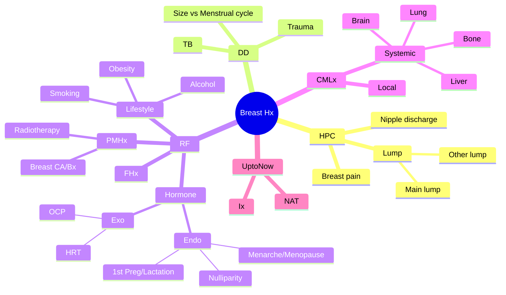
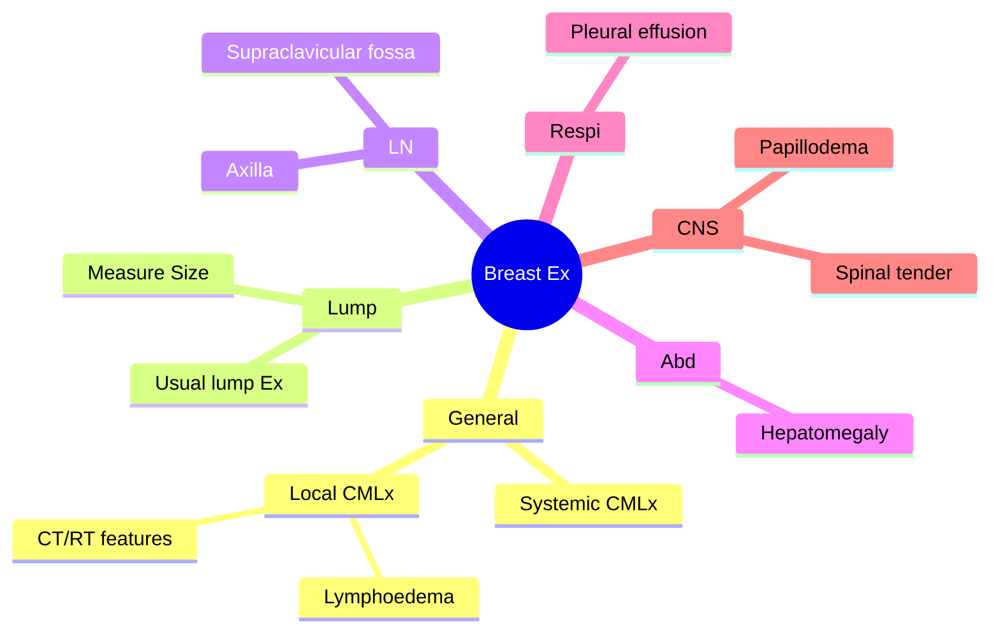

# Breast cancer long case

## History

### HPC
1. About the main breast lump
	- How did you 1st notice the lump?
	- Progression of the lump
	- Associated symptoms – pain, alteration of nipple, discharge
2. Other lumps
	- Is there any lump on opposite breast or axilla?
	- Previous breast lumps
3. Breast pain
	- Cyclical – in relation to menstrual cycle
	- non-cyclical
4. Nipple discharge
	- Unilateral/ bilateral
	- Single duct/ multiple duct
	- Spontaneous or expressed
	- Colour
### Differential diagnosis
- History of trauma
- Relationship of the size of the lump to the menstrual cycle
- History of tuberculosis
### Risk factors
- **Past history** 
	- of breast cancer or previous breast biopsies of,
		- Ductal or lobular atypical hyperplasia
		- LCIS
	- Supra-diaphragmatic radiotherapy
- **Family history** of breast, colonic, ovarian, prostate cancer
- **Hormone**: Increased oestrogen exposure
	- Endogenous
		- Early menarche
		- Nulliparity
		- Late age at first pregnancy
		- Not breast feeding
		- Late menopause
	- Exogenous
		- HRT
		- Combined OCP
- **Lifestyle** related
	- Alcohol/ smoking
	- Obesity
	- Reduced physical activity

### Features of dissemination
- Bone - pain & fracture
- Lung - Haemoptysis
- Brain - Recent onset headache or fits
- Liver - RHC pain or yellowish discolouration of eyes

### Things done upto now?
- Investigation + NAT & complications

### Fitness

### Other Hx
- PMHx
- PSHx
- AHx
- Drug history
- Social Hx
	- How do u feel about this lump? Explain the patients anxiety
## Examination

- General examination
	- Pallor, icterus
	- Features of CT/RT
	- Lymphoedema
- Breast 
- LN Ex 
	- axilla
	- supraclavicular fossa
- Abdominal examination – 
	- hepatomegaly , free fluid in the abdomen( request in early tumours but do in advanced tumours/recurrence)
- Respiratory – evidence of pleural effusions
- Spinal tenderness
- Neurological – papilloedema, focal neurological signs

## Recurrent Breast Cancer Evaluation

### History

- **Recurrent** Lump
	- Duration
	- Associated Symptoms
- **Previous Lumps**
	- **Previous Surgery**
		- Mastectomy or Wide Local Excision?
		- Sentinel Lymph Node Biopsy / ALND Axillary Lymph Node Dissection?
	- **Post-Mastectomy**
		- Complications?
		- Recurrence?
		- Follow-up?
	- **Previous Treatments**
		  - CT (Chemotherapy)/RT (Radiotherapy)/HT (Hormone Therapy)
		  - Neoadjuvant (Given or Not)
		  - Adjuvant CT/RT (Last RT Date)
	- **Medications**
		- Tamoxifen/Aromatase Inhibitors
		- Adverse Effects
- **Features of Dissemination**

### Examination

- **Inspection**
	- Features of Irradiation
	- Lymphoedema
	- Winging of Scapula
	- Latissimus Dorsi Muscle Function
	- CT Features

- **Lump**
	- Site, Size, Shape, Consistency, Margins
	- Attachments: Skin, Pectoralis Major, Chest Wall

- **Regional**
	- Lymph Nodes: 
		- Axillary
		- Supraclavicular
		- Infraclavicular
		- Internal Mammary
	- Numbness over Medial Arm

- **Contralateral Breast and Axillae**
	- Normal or Not

## Youtube Breast CA Discussion
