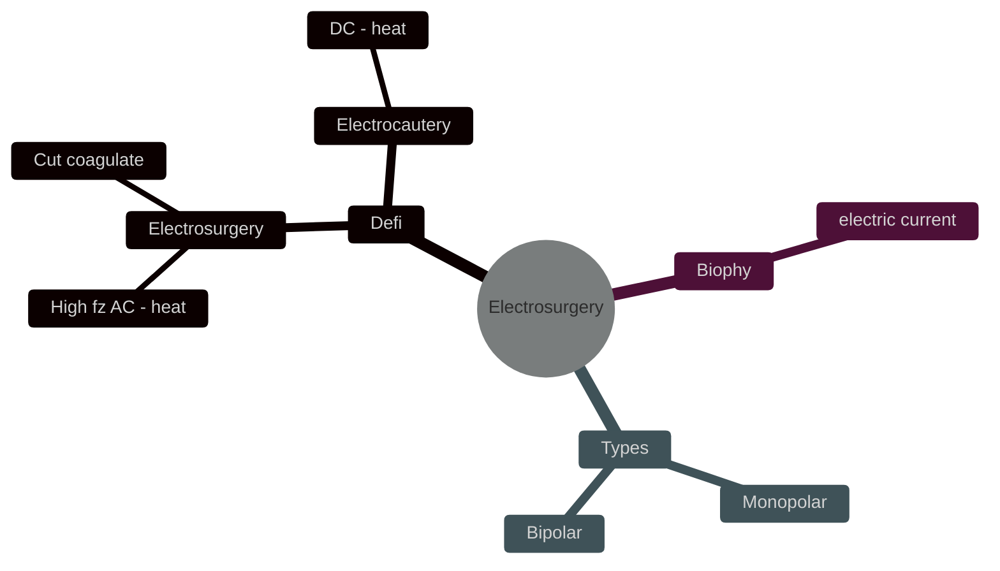
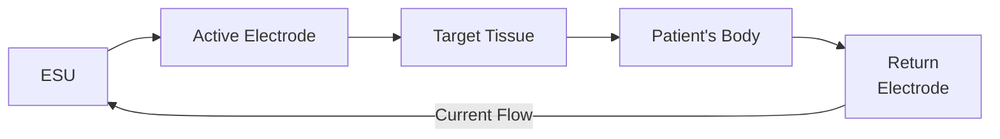

# ELECTROSURGERY AND ENERGISED 

## Introduction

### Definitions
- **Electrosurgery**: 
	- Uses high-frequency *alternating current (AC)* to generate heat, 
	- which is used to cut or coagulate tissue.
- **Electrocautery**: 
	- Uses *direct current (DC)* to generate heat at the tip of an instrument.

#### Monopolar
- **Active Electrode**: 
	- a small, precise electrode that generates heat at its tip
	- that delivers the high-frequency electrical current to the tissue.  
	- allowing for cutting or coagulating tissue at the point of contact.

- **Return Electrode**: 
	- aka **dispersive electrode** or **grounding pad**
	- The larger electrode placed elsewhere on the patient’s body. 
	- which safely return the *electrical current* from the patient back to the *electrosurgical unit (ESU)*. 
	- Because of its larger surface area, the current is dispersed over a wide area, minimizing heat production.

## Biophysics

### What is Electrical Current?

- **Electrical Current**: The flow of *electrons* through tissue between *adjacent atoms*.
- **Heat Generation**: 
	- As the current flows through tissue, the *tissue resists* the flow, 
	- converting the electrical energy into heat.

### Principle of Diathermy

- **Electrosurgical Unit (ESU)**: Generates the electrical current used in electrosurgery.
- **Heat Generation**: 
	- Depends on *current density,* which is the amount of current applied per ==unit area==.
    - **Maximum Heat**: 
	    - Generated where the current density is *highest*, 
	    - typically at the *tip* of the *active electrode*.
    - **Return Electrode**: 
	    - In monopolar circuits, a larger electrode placed in body, 
	    - *dissipating the current* and minimizing heat at that site.
- **Temperature Rise** is proportional to the *time* the active electrode is in contact with the tissue.

### Frequency of Electrical Current

- **High-Frequency Current**: 
	- Used by the ESU, ranging from 200 kHz to 3.3 MHz.
- **Low frequency current**: 
	- Used by household appliances
	- Using standard AC frequency (60 Hz) would cause unwanted neuromuscular stimulation.

### Current Waveforms in Electrosurgery

#### 1. Cutting Waveform (Low Voltage Continuous Current)
- **Wave**: Continuous, sine wave
- **Time**: ESU on 100% of the time.
- **Voltage**: low
- **Effects**:
    - **Cutting**: 
	    - When the active electrode is held *slightly away* from the tissue, 
	    - it quickly *vaporizes* the tissue.
    - **Desiccation**: 
	    - When the active electrode *touches* the tissue directly, 
	    - it *dries out* the cells, forming a *coagulum*.

#### 2. Coagulation Waveform (High Voltage Intermittent Current)
- **Wave**: Intermittent
- **Time**: The ESU is on only 6% of the time and off 94%.
- **Voltage**: High.
- **Effects**:
    - **Coagulation**: 
	    - Causes more heat to spread through the tissue, 
	    - leading to 
		    - *protein denaturation*, 
		    - *tissue shrinking*, and 
		    - forming a *coagulum*.
    - **Fulguration (Spray)**: 
	    - Creates *electrical arcing* in coagulation mode that *chars* tissue over a wide area. 
	    - Active electrode is held *slightly away* the tissue
	    - uses the *highest voltage* setting, so caution is needed.

#### 3. Blended Waveform
- **Wave**: Combination of both coagulation and cutting waveform. 
- **Time**: The ESU is on 50% of the time and off 50%.
- **Voltage**: Moderate.
- **Effects**:
    - Provides a mix of cutting and coagulation, with varying levels of each.

| **Waveform Type**        | **Time (ESU Output)**         | **Voltage** | **Effects**                                                                                                         |
| ------------------------ | ----------------------------- | ----------- | ------------------------------------------------------------------------------------------------------------------- |
| **Cutting Waveform**     | Continuous (100% on)          | Low         | - **Cutting**: *Vaporizes* tissue when the active electrode is *slightly away*.                                     |
|                          |                               |             | - **Desiccation**: *Dries* out tissue to form a *coagulum* when the active electrode *touches the tissue* directly. |
| **Coagulation Waveform** | Intermittent (6% on, 94% off) | High        | - **Coagulation**: Causes *protein denaturation, tissue shrinkin*g, and forms a *coagulum* due to thermal spread.   |
|                          |                               |             | - **Fulguration (Spray)**: *Electrical arcing chars* tissue when the active electrode is *slightly away*.           |
| **Blended Waveform**     | 50% on, 50% off               | Moderate    | - Produces a combination of *cutting* and *coagulation*, with varying degrees of each.                              |
|                          |                               |             |                                                                                                                     |

## Electrosurgical Circuit Types

### 1. Monopolar Delivery System

- **Circuit Flow**: ESU → Active Electrode → Target Tissue → Patient's Body → Return Electrode → ESU

- **Key Points for Placing the Return Electrode**:
	- **Material** should be made of *low-resistant* material.
	- **Surface Area** should be *large*.
	- **Placement Location**:
		- Should be placed over **well-vascularized muscle mass**, avoiding crossing a joint to *maximize conduction* of current.
		- Ideally placed in the **same quadrant as the operative site** to ensure the current travels the *shortest distance* through the patient's tissues.
	- **Placement Condition**: Ensure the electrode is **not wrinkled**.
	- **Avoid**:
		- Vascular insufficient areas.
		- High resistance areas (e.g., scar tissue, edematous tissue, bony prominences).

- **Preventing Alternative Current Pathways**:
	- Ensure **metal prostheses** and **ECG electrodes** are **out of the circuit's direct path**.
	- **Remove all metal piercings**.
	- The patient should **not be touching any metal part of the table**.

- Newer ESUs:
	- Feature **Contact Quality Monitors (CQM)** that **shut down** the unit if the contact surface area becomes too small.

### 2. Bipolar Delivery System

- **Circuit Flow**:  ESU → Active Tine → Target Tissue (between tines) → Return Tine → **ESU****

- Key Features:
	- **Patient's body** does **not form part of the circuit**.
	- Can be safely used on **narrow tissue pedicles** (e.g., penis).
		- **Monopolar use** in such cases may cause **high current densities** in the pedicle, leading to **thermal injury**.

## Safety Guidelines for Electrosurgical Units (ESU)

### 1. Training and usage

- **Train** all team members on the proper use of the ESU.
- Use the **lowest effective power setting** to minimize risk.

### 2. Implants 

#### Pacemaker Considerations

- **Avoid using diathermy** with patients who have pacemakers.
- **If diathermy is necessary**:
	- Prefer **bipolar diathermy**.
- **If monopolar diathermy must be used**:
	- Use **short bursts**.
	- Place the return electrode **as far away as possible** from the pacemaker.
- Intraoperative
	- Ensure **continuous ECG monitoring** during surgery.
	- Have a **defibrillator** readily available in the theatre.


##### Pacemaker settings
 - Set the pacemaker to **"maintain only" mode** to prevent inappropriate shock delivery due to electrical interference.
 - In **Emergency Surgery** If pacemaker settings cannot be adjusted, place a **magnet over the ICD** to inhibit shock delivery.


#### Cochlear Implants
- **Bipolar diathermy** should be used.
- **If monopolar diathermy is necessary**:
    - Place the return electrode **as close as possible** to the active electrode.

### 3. Skin Preparation
- Be cautious with **spirit-based fluids** as they can ignite and cause serious *burns*.
    - **Avoid pooling** of fluids in areas such as 
	    - the umbilicus, 
	    - under the drapes, or 
	    - around the return electrode.
    - Allow **adequate time for the fluid to dry** before proceeding.

## Electrosurgery in Endoscopy

### 1. Monopolar Snare Polypectomy

- **Pedunculated Polyps**:
	- Use **blended mode**.
- **Right Colon Polyps**:
	- Exercise **extreme caution** due to the *thinner wall*, which increases the *risk of perforation*.

### 2. Sphincterotomy in ERCP

- **Active electrode**: *sphincterotome* has a **monofilament** or **braided wire**.
- Ensure **short duration of contact time** with tissue to minimize damage.

### 3. Argon Plasma Coagulation (APC)

- APC Overview:
    - A form of *non-contact* **monopolar electrosurgery** used for *coagulation* and *fulguration*.
    - **Key Differences from Conventional Fulguration**:
        - Utilizes a stream of **inert argon gas** passing over the tip, which gets ionized, **confining the current** to pass through the gas and onto the tissue.
        - Allows **precision application** of current to tissues.

 
How argon plasma coagulation, coagulate a large area?
 - The current follows the **path of least resistance**, thus avoiding already coagulated tissue, thus rapidly coagulating a larger area.


- Uses:
    - **Endoscopy Setting**:
        - **Coagulation** of superficial vascular structures (e.g., **angiodysplasia**).
        - **Palliative ablation** of tumors.
        - **Hemostasis** following the resection of large polyps.
    - **Operative Setting**:
        - **Hepatic resection**.
        - **Retinal surgery**.

# Tissue Energizers: Advanced Bipolar and Ultrasonic Devices

## 1. Advanced Bipolar Devices

### Electrothermal Bipolar Vessel Sealing (EBVS) Devices

- Examples: Ligasure, Enseal
- How they work:
    - Combine bipolar current with mechanical compression
    - Can seal blood vessels up to 7mm in diameter
    - Process:
        1. High frequency, low voltage current denatures vessel wall proteins, elastin and collagen
        2. Mechanical pressure forms a coagulum (seal)
        3. Sensors in tip measure tissue impedance to ensure complete seal
        4. Energy delivery stops automatically when seal is complete
    - Tissue is then cut mechanically

## 2. Ultrasonic Devices

### Harmonic Scalpel

- Converts electrical energy to **ultrahigh frequency mechanical energy** (55,500 Hz/second)
- How it works:
    1. Mechanical energy generates heat
    2. Heat denatures proteins, forming a coagulum to seal vessels
    3. Can seal vessels up to 5-7mm
    4. Maximum temperature: 150°C (minimizes thermal spread)
- Cutting mechanisms:
    1. Heat-induced cellular vaporization ("**cavitational cutting and fragmentation**")
    2. Tissue stretching beyond elastic limit

### LOTUS (LaparOscopic dissection by Torsional UltraSound)

- Uses torsional ultrasound to minimize "distal drilling effect"

## 3. Combined Energy Devices

### Thunderbeat

- Uses both ultrasonic and bipolar energy
- Two modes:
    1. Seal and cut: simultaneous ultrasonic and bipolar energy
    2. Seal: purely bipolar energy for vessel sealing
- Sensors measure tissue impedance to prevent excess energy delivery

**Note**: Choice of device depends on preference, availability, and cost. All of above devices are almost equal in clinical trials.

## Hazards of Electrosurgery

### A. Electrothermal Injuries

#### General Surgery Risks

1. Diathermy pad burns
2. Insulation failure
    - Breaks in active electrode insulation (common in distal third)
    - Current can discharge from defects

#### Laparoscopic Surgery Specific Risks

- Off-camera injuries (1-5 per 1000 laparoscopies)
##### Direct Coupling
- If the electrosurgical unit (ESU) is accidentally activated while the *active electrode is close to another metal instrument*, current can flow through that second instrument.
  
##### Capacitance Coupling
- A capacitor forms when *two conductors* are separated by a *non-conductor*.
- An electrostatic field is created between the conductors, allowing alternating current (AC) to pass through (but not direct current).

- **How It Works:** The active electrode (Conductor 1) can pass current through intact insulation (Non-conductor) into an adjacent metal object (Conductor 2) like a trocar or even nearby bowel.
- **Prevention:** Activate electrosurgical device only after the *electrode is in contact with the target tissue*, the energy will go directly into the tissue.


 - Don't activate monopolar diathermy **before** the electrode touches the target tissue.
 - the current might pass through the insulation into the adjacent conductor.



 - **Capacitance coupling in open surgery**
	- A towel clip can cause similar issues if used to hold the electrosurgery wires.
	- If the towel clip touches the patient, it could cause burns.


### B. Fire and Explosion Risks

- Caused by alcohol-based skin preparations

### C. Electrosurgical Smoke

- Carcinogenic
- Irritates respiratory mucosa
- Can transmit viral infections

## Preventing Electrothermal Damage

  - Always keep the active electrode in full view.
  - **Tenting Technique:** Lift tissue away from surrounding structures before activating the ESU.
  - **When to Activate:**
    - Only activate the ESU when you have a clear view of the field and the electrode is in contact with the tissue. Avoid non-contact activation.
  - **Power Usage:** Use the lowest voltage mode necessary to achieve the desired effect. Avoid overshooting power settings.
  - **Handling the Electrode:**
    - The tip stays hot for several seconds—don't let it touch anything inside or outside the body. The scrub nurse should place it in a quiver.
  - **Single Use Electrodes:**
    - Discard after one use; do not reuse.
  - **Consider Alternatives:**
    - Use bipolar or ultrasonic electrosurgical devices if available.