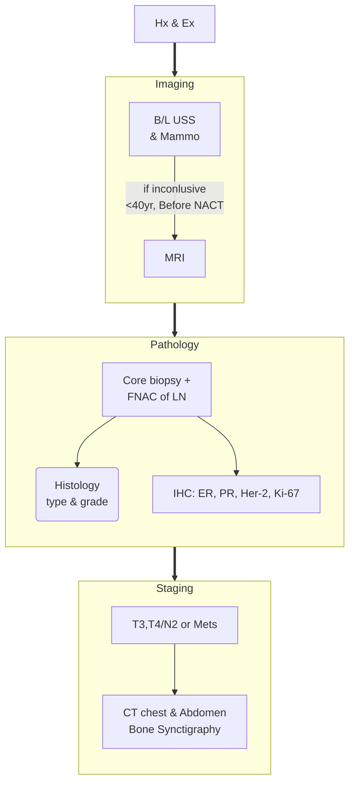

## Clinical Evaluation

- The triple assessment of clinical examination, imaging, and histopathology remains the cornerstone of the diagnostic work-up in patients suspected to have breast cancer.
- Obtain a full history and perform a complete general examination, including an examination of the breasts, axillae, and supraclavicular fossae.
- Stage the tumor according to the **American Joint Committee on Cancer staging system**.

## Imaging

- All patients with suspected breast cancer should undergo bilateral mammography and ultrasonography before pathological evaluation.
- As a practical measure to overcome delays, consider performing an **ultrasound scan of bilateral breasts** as the initial imaging investigation.
- Patients with a clinical and radiological suspicion of malignancy should be referred to the nearest radiology unit with facilities to perform a mammogram.
- **Magnetic resonance imaging (MRI) of the breast** is recommended in patients with inconclusive findings on ultrasound and mammography.

## Pathology
### Biopsy and Immunohistochemistry (IHC) Guidelines

#### Core Needle Biopsy and Axillary Lymph Nodes

- Core needle biopsy of suspicious breast lesions and either fine needle cytology or core needle biopsy of suspicious axillary lymph nodes should be performed preferably under image guidance.
- Obtain at least **2 cores**, and in patients with suspected multifocal disease, biopsy all lesions as far as possible.
- For patients undergoing neoadjuvant chemotherapy to facilitate breast conservation surgery, consider **placing surgical clips under ultrasound guidance**.

#### Biopsy Approach

- **Excision biopsy** is strongly discouraged unless at least two attempts at core needle biopsy failed to yield a confirmatory diagnosis.

#### Immunohistochemistry (IHC) Testing

- Perform IHC for **Oestrogen Receptor (ER), Progesterone Receptor (PR), Her2/Neu overexpression (Her2), and the proliferation marker Ki67** in all core biopsy samples with invasive cancer.
- Report IHC for ER, PR, and Her2 according to the **ASCO/CAP guidelines**.
- For patients with equivocal Her2 overexpression on IHC, **test for gene amplification using in-situ hybridization (ISH) techniques** to detect Her2 gene amplification.

#### ISH Testing and Cost Considerations

- ISH testing is currently **not available in the state sector**. It can only be performed elsewhere if patients can afford its cost.
- Until ISH testing is available in the state sector, consider establishing a mechanism for this investigation to be performed outside of the state sector at **no cost to the patient**.

#### Ki67 Risk Stratification

- For Ki67, consider:
    - **<10% as low risk**
    - **10-20% as intermediate risk**
    - **>20% as high risk**

#### Categorization of Patients

- Categorize patients based on the IHC profile into:
    - **Luminal A**
    - **Luminal B Her2 Negative**
    - **Luminal B Her2 Positive**
    - **Her2 Positive (non-luminal)**
    - **Triple Negative**

|                | LUMINAL A                    | LUMINAL B                                                           | TRIPLE NEGATIVE                                      | HER-2 ENRICHED                             |
| -------------- | ---------------------------- | ------------------------------------------------------------------- | ---------------------------------------------------- | ------------------------------------------ |
| ER+ and/or PR+ | ER+                          | ER+ and/or PR+                                                      | ER-                                                  | ER-                                        |
| HER-2 -        | and/or PR+                   | HER-2 - / HER-2 +                                                   | PR-                                                  | PR-                                        |
|                | HER-2 -                      |                                                                     | HER-2 -                                              | HER-2 +                                    |
| Ki-67 < 14%    | (Low proliferation)          | Ki-67 = 14% (High proliferation)                                    | -                                                    | -                                          |
| Most common    | (≈ 70%)                      | 10%                                                                 | Common in premenopausal, young & overweight patients | Less common                                |
|                |                              |                                                                     |                                                      |                                            |
| Grade          | Low grade                    | Intermediate to high grade                                          | High grade                                           | Mid to high grade                          |
| Prognosis      | Good prognosis               | Prognosis worse than luminal A but better than HER-2 enriched tumor | Poor prognosis                                       | Prognosis much improved since trastuzumab  |
| Treatment      | Respond to endocrine therapy | Respond to cytotoxics + anti-HER-2 + endocrine therapy              | Respond to cytotoxics therapy                        | Respond to cytotoxics + anti-HER-2 therapy |
## Staging

- Routine staging (computed tomography scan of the chest and abdomen and bone scintigraphy) is recommended in patients with locally advanced disease (T3, T4, or N2 disease) and in other patients with symptoms suggestive of metastatic disease.

## Other Investigations

- We recommend performing the following tests:
    - Complete blood count
    - Liver and renal profile
    - Serum calcium and alkaline phosphatase levels
    - Echocardiography
- **Do not recommend performing the tumor marker CA 15.3**, as it has no proven value in early or locally advanced breast cancer.

## Recommended timelines for diagnostic workup
|**Investigation**|**Timeframe**|
|---|---|
|Time to first Specialist Consultation|Next available clinic (within 1 week)|
|Imaging: Ultrasonography|2 weeks from date of request (in patients of high clinical suspicion of malignancy)|
|Imaging: Mammography|2 weeks from date of request (in patients with high suspicion on clinical and ultrasonic evidence)|
|Imaging: Staging|2 weeks from date of request|
|Core needle Biopsy (CNB)|1 week after ultrasonography and mammography|
|Histopathology Reporting (initial)|2 weeks after CNB|
|Immunohistochemistry of CNB|3 weeks after CNB|

## Management
- Neoadjuvant chemotherapy (NAC) 
	- Indications
		- T4, including inflammatory breast cancer
		- N2 or more regardless of tumour biology
	- Depending on the response to NAC mastectomy or breast conservative surgery with standard axillary clearance is recommended.
- T1 N0 - 
	- Sx: upfront surgery regardless of tumor biology
	- eminently resectable with breast conservation surgery.
- **T1-T2 N1** or **T3 N0-1** + *HER2 positive or triple negative*
	- considering NAC as a strategy for facilitating breast conservation surgery is recommended.
	- Sx: wide local excision followed by standard axillary clearance after completing NAC.
- **T2 N0** and *HER2 positive or triple negative*
	- evaluating the merits of NAC and its impact on axilla treatment on an individual basis is recommended.
	- If these patients are treated with NAC, 
		- performing a sentinel node biopsy prior to NAC or a standard axillary clearance after NAC is advised.
	- Post-NAC sentinel node biopsy should be undertaken with caution.
- *ER+ Her2-* + **T1-T2 N1** and **T3 N0-1** 
	- Sx: upfront surgery since the response to NAC is poor.
- Placement of surgical clips under ultrasound guidance is mandatory prior to NAC if it is undertaken with a view to facilitating breast conservation surgery.

|**Receptor Status**|**TNM Staging**|**Management Recommendations**|
|---|---|---|
|HER2 positive or triple negative|T1-T2 N1 or T3 N0-1|Consider NAC to facilitate breast conservation surgery. Wide local excision followed by standard axillary clearance after NAC.|
|HER2 positive or triple negative|T2 N0|Evaluate merits of NAC individually. Perform sentinel node biopsy prior to NAC or standard axillary clearance after NAC.|
|ER+ Her2-|T1-T2 N1 or T3 N0-1|Proceed with upfront surgery; poor response to NAC.|
|Any receptor status|T4 or N2 or more nodal disease|Indicated for NAC. Breast conservation surgery or mastectomy with standard axillary clearance based on NAC response.|
| |T1 N0 |Upfront surgery recommended; often eminently resectable with breast conservation surgery.|

## Mastectomy versus Breast Conservation Surgery

- **Primary Treatment Options** for non-metastatic breast cancer:
    - **Breast Conservation Surgery (BCS)** or **Mastectomy**.
- **Contraindications to BCS**:
    - Multicentric disease.
    - T4 primary tumor (including inflammatory breast cancer).
    - Large tumor relative to breast volume.
    - Contraindications for adjuvant whole breast radiotherapy.
- **Recommendations for BCS**:
    - BCS is the treatment of choice for early breast cancer patients without contraindications.
    - Patients suitable for BCS should be informed of the following:
        - BCS has equal or possibly superior survival compared to mastectomy.
        - Better long-term quality of life and functional outcome for patients treated with BCS.
- **BCS Margins**:
    - In patients undergoing BCS for invasive cancer:
        - Absence of tumor (invasive cancer and DCIS) at the inked margin is sufficient.
        - If a positive inked margin is found, re-excision is recommended.
        - If margins remain positive after two excision attempts, consider offering mastectomy.
- **Mastectomy Patients**:
    - All patients treated with mastectomy should be offered breast reconstruction.

## Treatment of axilla

- **Sentinel Lymph Node Biopsy (SLNB) Recommendations** for patients with cT1-2 N0 tumors:
    - Perform SLNB using either methylene blue dye, radiopharmaceutical tracer, or a combination of both.
    - Intra-operative assessment of sentinel lymph nodes using imprint cytology, cytology smears, or frozen section.
    - Exercise caution when performing SLNB in patients treated with neoadjuvant chemotherapy due to limited experience.
- **Axillary Clearance Criteria** for patients in whom SLNB is performed:
    - **Three or more macrometastases (>2mm)** or any macrometastases with extra-nodal extension: Perform axillary clearance.
    - For 1-2 macrometastases, consider axillary clearance if any of the following criteria are met:
        - Treatment of the primary tumor is mastectomy.
        - Grade III tumor.
        - Tumor size is more than 2cm.
        - ER negative or Her2 positive on IHC.
- **Alternative to SLNB**:
    - If SLNB is not feasible, consider axillary nodal sampling in patients with cT1-2 N0 tumors.
- **Axillary Clearance Recommendations**:
    - Recommended for all patients with cT3 or higher primary tumors.
    - Also recommended for those with cN1 or higher axillary nodal stage.
    - Standard axillary clearance includes dissection of levels I and II, harvesting a minimum of 10 lymph nodes.

## Adjuvant therapy

- **Adjuvant Radiotherapy After Breast Conservation**:
    - Offer whole breast radiotherapy to all patients with invasive cancer or DCIS treated with breast conservation surgery.
    - Consider not offering whole breast radiotherapy in patients above 65 years who meet the following criteria:
        - DCIS, T1 or T2 tumors less than 3cm.
        - Node negative.
        - ER+ PR+ Her2.
        - Grade 1-2.
        - Willing to take endocrine treatment for 5 years.
- **Post-Mastectomy Adjuvant Radiotherapy (PMRT)**:
    - Recommended for:
        - T3 or T4 invasive cancer.
        - 4 or more involved axillary lymph nodes.
        - 1-3 involved lymph nodes with macrometastases.
        - Positive margins.
    - Considered in patients with 1-3 involved lymph nodes with micrometastases.
    - Not offered for patients with pT1-2 N0 invasive cancer.
- **Dose of Radiotherapy**:
    - For patients offered adjuvant whole breast radiotherapy or post-mastectomy radiotherapy (without nodal irradiation):
        - 26 Gy in five fractions over one week.
    - For patients receiving nodal radiotherapy:
        - 40 Gy in 15 fractions over three weeks.

## Adjuvant Chemotherapy

### Benefit of Adjuvant Chemotherapy

- Adjuvant chemotherapy should be offered to all patients in the following categories who are fit enough to receive it:
    - **Patients with triple negative or HER2 positive tumors** which are of **T1b N0 or higher stage**
    - **Patients with luminal A tumors** which are **pT3 N0 or pN2 or higher nodal stage**
    - **Patients with luminal B HER2 negative tumors** which are **pT3 N0 or pN1 or higher nodal stage**
    - We recommend weighing the risk and benefit in patients with **pT1-2 N0 Luminal B Her2 negative** patients on an individual basis.

### Adjuvant Chemotherapy Regimen

- Offer dose-intensified **anthracycline and taxane based regimens** for use in both adjuvant and neoadjuvant settings for patients who are fit enough to receive it.
- Consider **carboplatin based chemotherapy regimens** in patients with **triple negative tumors** receiving neoadjuvant treatment.
- Consider **adjuvant capecitabine** in patients with **triple negative tumors** not achieving a complete pathological response after treatment with neoadjuvant chemotherapy if the regimens did not contain a platinum agent.

### Anti-HER2 Therapy

- **Trastuzumab**
    - Offer adjuvant trastuzumab in addition to chemotherapy to all patients with **HER2+ tumors** which are of **T1b N0 or higher stage** and fit enough to receive it. In patients receiving taxane based adjuvant chemotherapy regimen, adjuvant trastuzumab should be delivered concurrently with taxanes.
    - Consider **weekly Paclitaxel** in combination with trastuzumab for patients with **T1-T2 (less than 3cm) N0 HER2+ tumors**.
    - In patients with **HER2+ tumors** being offered neoadjuvant chemotherapy (see section 3.2), trastuzumab should be delivered in combination with a taxane.

## Adjuvant Endocrine Therapy

### Premenopausal Patients

- Offer **ovarian suppression** with either surgery or GnRH analogues for premenopausal patients with **ER+ tumors** if younger than 40 years of age or adjuvant chemotherapy is indicated based on tumor risk stratification.
- Offer **adjuvant tamoxifen** for 5-10 years in patients with **ER+ tumors** not treated with ovarian suppression.
- Offer adjuvant treatment with an **aromatase inhibitor** as for postmenopausal patients in patients treated with ovarian suppression.

### Postmenopausal Patients

- Offer adjuvant treatment with an **aromatase inhibitor** (anastrozole, letrozole, or exemestane) for post-menopausal patients with **ER+ tumors** for 5 years.
- Offer adjuvant treatment with **tamoxifen** for 5-10 years in patients not tolerating aromatase inhibitors.

### Adjuvant Endocrine Therapy in DCIS

- Consider adjuvant endocrine therapy as a strategy of reducing the risk of breast cancer recurrence in selected patients with **ER+ DCIS** after explaining the risks of treatment and that there is no reduction in mortality with such treatment.

### Adjuvant Bisphosphonate Therapy

- Offer adjuvant intravenous **zoledronic acid 4mg** every six months for five years for all post-menopausal breast cancer patients, including patients with chemotherapy-induced menopause and those treated with ovarian suppression.

## Follow-up Schedule After Adjuvant Treatment

- **First 2 years**:
    - Clinical review every **3 months**
- **Next 3 years**:
    - Clinical review every **6 months**
- **Subsequent 5 years**:
    - Annual clinical review

Additionally, an **annual mammogram** should be performed throughout these 5 years. Regular follow-up ensures timely assessment and helps manage any potential recurrence or new developments.
