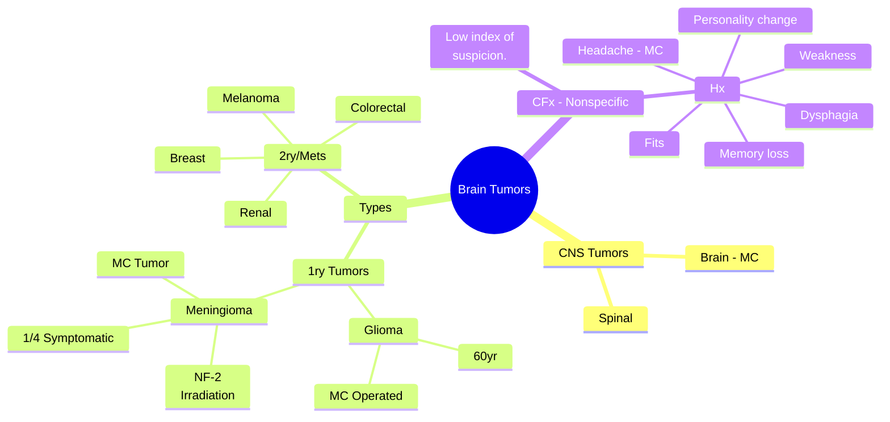

# Tumours of the Central Nervous System

## Introduction
- The **prognosis** for a brain tumour diagnosis remains poor. 
- The three **most common** *brain tumours* are 
	- meningiomas - Most common brain tumor
	- Glioma is the most commonly operated brain tumour.
	- and cerebral metastases.
- For patients diagnosed with brain tumours, surgery is rarely curative. 
- Surgery may be offered to 
	- aid control of tumour growth, 
	- alleviate patient symptoms, 
	- or control raised intracranial pressure. 

## Classification of CNS Tumours
- Most central nervous system tumours occur in the brain. 
- Tumours may be primary or secondary (metastatic). 

### Primary Tumours
- **Glioma** and **meningioma** are the most common.

### Secondary Tumours
- Common primary sites that metastasize to the brain include breast, renal, melanoma, and colorectal tumours.

## Clinical feature
- Symptoms can be non-specific, including 
	- personality changes, 
	- memory loss, 
	- headache
	- weakness, 
	- dysphasia, and 
	- seizures. 

>[!warning] 
>- **Delay in diagnosis**: Brain tumour patients typically see their GP five times before diagnosis.

## Imaging
### MRI Brain
- Consider MRI in any patient with progressive, sub-acute loss of central neurological function. 
- CT scans are adequate for immediate needs
- but MRI provides more detail, especially with intravenous contrast.

### Imaging Characteristics
- **Glioblastomas (GBMs)**: 
	- Enhance heterogeneously with contrast, 
	- usually localized to a single focus.
- **Meningiomas**: 
	- Located adjacent to cerebral meninges, 
	- often showing a CSF cleft and homogenous enhancement with contrast.
- **Metastases**: 
	- Multiple foci in discrete brain regions, 
	- often at the grey-white matter junction.

## Management
- Brain imaging predicts tumour type, but histological examination confirms the diagnosis. 
- Surgical approaches aim for tumour debulking rather than just biopsy.

### Primary brain tumors
#### Gliomas
- **Most commonly** operated brain tumor.
- *Glioblastoma* is the most common.
- Peak age 60yr.
- Treatment includes 
	- Surgical resection followed by radiotherapy and temozolomide.

#### Meningiomas
- **Most common** primary brain tumour, often found incidentally.
- Arise from *arachnoid cap cells* of the dural meninges.
- Risk factors 
	- Previous cranial irradiation and 
	- neurofibromatosis type 2.
- Only a quarter (**1/4**) of patients are *symptomatic* at presentation.
- Incidental lesions are 
	- small, 
	- located adjacent to non-eloquent brain, and 
	- heavily calcified.

### Secondary Brain Tumours
- Commonly metastasize from 
	- breast, 
	- renal, 
	- melanoma, and 
	- colorectal primaries.
- Surgery is considered if systemic disease is controlled and there is a single symptomatic lesion.

